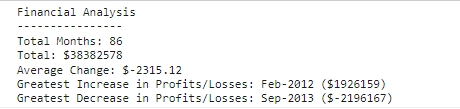

# Module Challenge – Console Finances
## Description
This project is to create code for analyzing financial records of the company using JavaScript.

The most difficult part of the project in my opinion is to work out how to store the changes of profit/loss over the period without logging it. It wasn’t difficult to create a statement to calculate the changes but I did spend hours trying to manipulate the new set of data (changes) and turn it into an array. The ‘split’ method taught me to turn the long string to an array of strings. More importantly, understanding its data type (string/number) gave me a chance to see how I can find the value by changing data type, and achieve what I wanted to see. 

This week I benefited a lot from the content I read during my self-study hours:
The LinkedIn Learning course I am watching now fills the gap of some basic concepts that were not covered in the past week, such as functions and array methods. Even though ‘const’ and ‘let’ are not used in my project, I have learned what their differences are. Knowing different array methods is very useful for this project in particular, where I had to return specific value from the finances array made up of sets of array! 

I am not a fan of MDN Web Docs site because its interface doesn’t look interesting. However, it’s still very useful as the source of everything I should know about languages. I learned more about math-related methods this time and applied it to my project.

The most useful part of W3Schools tutorial this time is that its demo helped me learn a lot about array methods. When I first watched the LinkedIn Learning course, I thought ‘shift’ and ‘pop’ return the array without specific values. However, they return the removed item, which saved me some time figuring out how to get rid of the monthly amount item after the mm-yy item in the array. 

However, I also noticed that without the reference answer provided in the instructions, I would probably locate the wrong month because of overlooking the index starting value (0 or 1). Also, the code may be a bit simpler if I had more knowledge of functions – I will spend more time learning about functions and objects in the coming week to deepen my understanding of JavaScript.

Link to the repository:
https://github.com/leesoohang/Console-Finances.git

Link to the live application:
https://leesoohang.github.io/Console-Finances

## Installation
N/A

## Usage
The application can be found as ‘index.html’ under the parent folder in the repository alongside the script file ‘script.js’.

The screenshot of the console:

## Credits
JavaScript Essential Training by Morten Rand-Hendriksen on LinkedIn Learning: 

https://www.linkedin.com/learning-login/share?account=74653818&forceAccount=false&redirect=https%3A%2F%2Fwww.linkedin.com%2Flearning%2Fjavascript-essential-training%3Ftrk%3Dshare_ent_url%26shareId%3DokISIJTORMuVS3bcmK5Lbw%253D%253D

JavaScript Guide on MDN Web Docs:

https://developer.mozilla.org/en-US/docs/Web/JavaScript/Guide

JavaScript Tutorial on W3Schools:

https://www.w3schools.com/js/default.asp